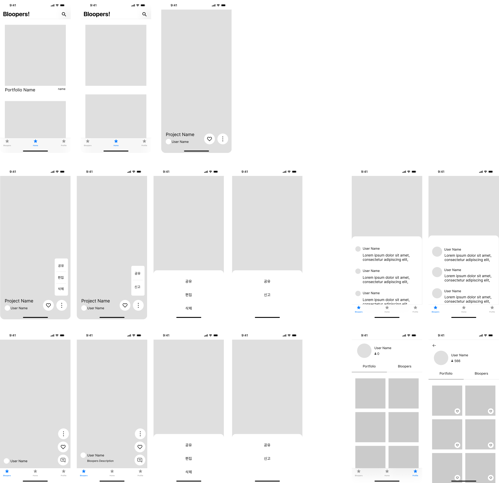

# Bloopers!
자기 작업물과 만들 때의 과정들을 story처럼 올리는 SNS입니다. (Behance + Instagram Story(Shorts))

# 개발 목표
1. 객체지향 원리를 기반한 올바른 코드 작성
2. 기술을 학습하고 프로젝트 적재적소에 적용
3. 지속적인 성능 개선
4. [Google Code Style 준수](https://google.github.io/styleguide/javaguide.html)
   

   
# Wireframe
[상세보기](./Docs/UI/UI.md)

[Figma Wireframe 보러가기](https://www.figma.com/file/dpDXYWfzB7W9ZPOqKoMo1R/Bloopers!?type=design&node-id=0%3A1&mode=design&t=j4qFaw5suioO1mGw-1)

# API Signature
[API Signature 정리](./Docs/API_Signature.md)

# DB ERD

